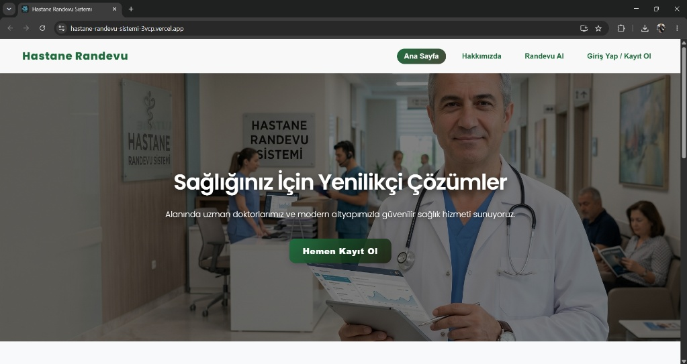
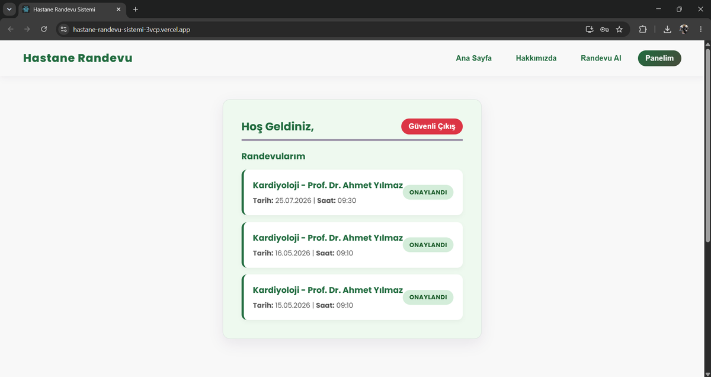
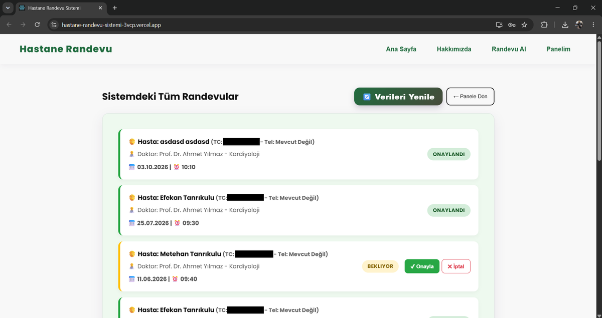
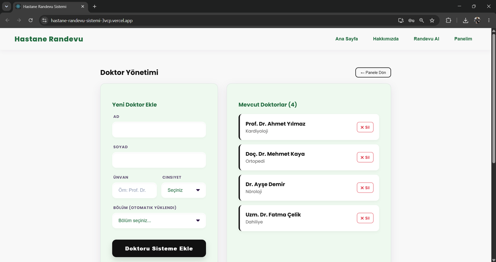

# 🏥 Hastane Randevu Sistemi


**[🔗 Canlı Demo](https://hastane-randevu-sistemi-3vcp.vercel.app/)**

## 📌 Proje Hakkında

Hasta, doktor ve admin olmak üzere üç farklı yetki seviyesine sahip, uçtan uca geliştirilmiş bir hastane randevu yönetim sistemi. Fikirden canlıya (production) kadar tüm süreci — veritabanı tasarımı, backend API geliştirme, kimlik doğrulama, rol bazlı yetkilendirme ve deployment — tek başıma tasarlayıp geliştirdim.

Bu proje bana özellikle şunları kazandırdı:
- Rol bazlı yetkilendirme (RBAC) mantığını gerçek bir senaryoda kurgulama
- İlişkisel veritabanı tasarımı (hasta–doktor–randevu ilişkileri)
- Bulut tabanlı veritabanı yönetimi ve production deployment deneyimi

---

## 👥 Roller ve Özellikler

| Rol | Yetkiler |
|---|---|
| **Hasta** | Kayıt olma / giriş yapma, doktor & branşa göre randevu alma, randevularını görüntüleme/iptal etme |
| **Doktor** | Kendine ait randevuları görüntüleme, hasta bilgilerine erişim, çalışma takvimi/uygunluk yönetimi |
| **Admin** | Doktor ekleme/çıkarma, tüm randevuları yönetme, kullanıcı yönetimi |

> Kimlik doğrulama (login/register) tüm roller için JWT (JSON Web Token) tabanlı oturum yönetimiyle sağlanıyor.

---

## ⚙️ Sistem Mimarisi

```text
[ React (Frontend) ]
        │  HTTP / REST API istekleri
        ▼
[ Node.js + Express (Backend API) ]
        │  Kimlik doğrulama & yetkilendirme (JWT)
        │  Rol bazlı erişim kontrolü (Hasta / Doktor / Admin)
        ▼
[ MySQL Veritabanı — Aiven Cloud ]
        - Kullanıcılar (roller ile)
        - Doktorlar & branşlar
        - Randevular
```

**Deployment:** Frontend Vercel üzerinde, backend Render üzerinde, veritabanı Aiven Cloud üzerinde yönetilen MySQL instance'ı olacak şekilde üç ayrı bulut servisi entegre edilerek yayınlandı.

---

## 🛠️ Kullanılan Teknolojiler

| Katman | Teknoloji |
|---|---|
| Frontend | React |
| Backend | Node.js, Express.js |
| Veritabanı | MySQL (Aiven Cloud) |
| Kimlik Doğrulama | JWT (JSON Web Token) |
| Deployment | Vercel (frontend), Render (backend) |

---

## 🚀 Kurulum (Local Development)

```bash
# Repoyu klonla
git clone https://github.com/vasquenos/hastane-randevu-sistemi.git
cd hastane-randevu-sistemi

# Backend bağımlılıklarını kur
cd backend
npm install

# .env dosyasını oluştur
DB_HOST=your_aiven_host
DB_PORT=your_aiven_port
DB_USER=your_db_user
DB_PASSWORD=your_db_password
DB_NAME=your_db_name
JWT_SECRET=your_secret_key

# Backend'i başlat
npm start

# Frontend bağımlılıklarını kur (yeni terminal)
cd ../frontend
npm install
npm start
```

> ⚠️ `.env` dosyasını `.gitignore`'a eklemeyi unutma — veritabanı bilgilerinin repoda görünmediğinden emin ol.

---

## 📷 Ekran Görüntüleri

| Giriş Ekranı | Hasta Paneli |
|---|---|
|  |  |

| Doktor Paneli | Admin Paneli |
|---|---|
|  |  |

---

## 🔮 Geliştirme Fikirleri

- [ ] E-posta/SMS ile randevu hatırlatma bildirimleri
- [ ] Randevu geçmişi ve raporlama (PDF/Excel dışa aktarma)
- [ ] Docker ile containerize etme
- [ ] Refresh token ile JWT oturum süresini uzatma

---

## 📬 İletişim

[LinkedIn / Portfolyo linkin]
